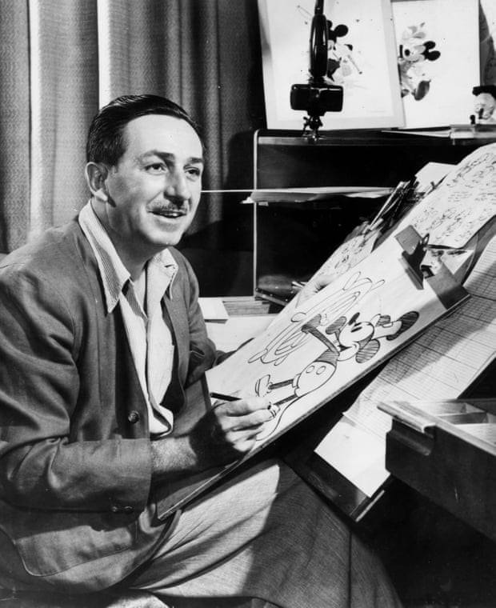

# MiniCPM-V-2_6-rkllm

Run the Powerful MiniCPM-V-2.6 Visual Language Model on Orange Pi RK3588!

- Inference speed (RK3588): Visual encoder + LLM prefill  + decoding => very fast
- Memory usage (RK3588, default context length): Visual encoder 1.9GB + LLM 7.8GB + OS ~ 106 GB RAM (need to run on a 16BG RAM Orange Pi

## Usage

1. Clone or download this repository locally. The models is not included, they will be downloaded from Hugging face while running the ap

```bash
git clone https://github.com/thanhtantran/MiniCPM-V-2_6-rkllm
cd MiniCPM-V-2_6-rkllm
```
   
3. The RKNPU2 kernel driver version on the development board must be >=0.9.6 to run such a large model. 
   Use the following command with root privileges to check the driver version:
   ```bash
   > cat /sys/kernel/debug/rknpu/version 
   RKNPU driver: v0.9.8
   ```
   If the version is too low, please update the driver. You may need to update the kernel or refer to official documentation for help.
   
4. Install dependencies

```bash
pip install -r requirements.txt
```
You also need to install rknn-toolkit2-lite, this can work with the latest rknn-toolkit2-lite so you can install by

```bash
pip install rknn-toolkit2-lite
```
In case you want to install specific rknn-toolkit2-lite, go to https://github.com/airockchip/rknn-toolkit2/tree/master/rknn-toolkit-lite2 and download it

4. Run
   
```bash
streamlit run streamlit_app.py
```
This app will run a a brower

man.jpg:


```bash
admin@orangepi5:~/MiniCPM-V-2_6-rkllm$ python multiprocess_inference.py
Start loading language model (size: 7810.02 MB)
I rkllm: rkllm-runtime version: 1.1.4, rknpu driver version: 0.9.8, platform: RK3588

W rknn-toolkit-lite2 version: 2.3.0
Start loading vision encoder model (size: 942.29 MB)
Vision encoder loaded in 4.95 seconds
I RKNN: [13:13:11.477] RKNN Runtime Information, librknnrt version: 2.3.0 (c949ad889d@2024-11-07T11:35:33)
I RKNN: [13:13:11.477] RKNN Driver Information, version: 0.9.8
I RKNN: [13:13:11.478] RKNN Model Information, version: 6, toolkit version: 2.2.0(compiler version: 2.2.0 (c195366594@2024-09-14T12:24:14)), target: RKNPU v2, target platform: rk3588, framework name: ONNX, framework layout: NCHW, model inference type: dynamic_shape
Received ready signal: vision_ready
Language model loaded in 30.56 seconds
Received ready signal: llm_ready
All models loaded, starting interactive mode...

Enter your input :

Describe the person in the image {{./man.jpg}}?
How many people are in the image?


Start vision inference...
Vision encoder inference time: 3.61 seconds
Time to first token: 2.09 seconds
There is one person in the image the second image . The focus of this photograph seems to be on an individual, as there are no other discernible figures present. Please note that I can only provide descriptions based on what's visible within the images you've shared. If you have any specific questions about the content or need further details, feel free to ask!

(finished)

--------------------------------------------------------------------------------------
 Stage         Total Time (ms)  Tokens    Time per Token (ms)      Tokens per Second
--------------------------------------------------------------------------------------
 Prefill       2040.37          112       18.22                    54.89
 Generate      22301.36         72        310.92                   3.22
--------------------------------------------------------------------------------------
```

## Model Conversion

#### Preparation

1. Install rknn-toolkit2 v2.1.0 or higher, and rkllm-toolkit v1.1.2 or higher.
2. Download this repository locally, but you don't need to download the model files ending with `.rkllm` and `.rknn`.
3. Download the MiniCPM-V-2.6 Hugging Face model repository locally. (https://huggingface.co/openbmb/MiniCPM-V-2_6)
  
#### Converting LLM

1. Copy the `rename_tensors.py` file from this repository to the root directory of the MiniCPM-V-2.6 Hugging Face model repository and run it. Wait for a moment, it will generate 4 safetensors files like `model-renamed-00001-of-00004.safetensors` and a json file.
2. Ignore the json file, move those 4 safetensors files to the root directory of this repository.
3. Execute `rkllm-convert.py`. After a while, it will generate `qwen.rkllm`, which is the converted model.

#### Converting Visual Encoder

1. Copy `patched_modeling_navit_siglip.py` and `patched_resampler.py` from this repository to the root directory of the MiniCPM-V-2.6 Hugging Face model repository, rename them to `modeling_navit_siglip.py` and `resampler.py`, replacing the original files.

2. Open `vision_export_onnx.py`, modify the `MODEL_PATH` to the path of the MiniCPM-V-2.6 model folder. Then execute it. After a while, it will generate `vision_encoder.onnx`.
3. Execute `vision_convert_rknn.py`. After a while, it will generate `vision_encoder.rknn`, which is the converted visual encoder.

## Known Issues

- ~~Due to a suspected issue in RKLLM, this model currently cannot perform inference normally.~~ (Fixed)
- ~~Due to an issue in RKLLM, the visual encoder and LLM cannot be loaded simultaneously at present. The visual encoder must be unloaded first, then the LLM reloaded. If multiple inferences are required, the unloading and loading operations must be repeated, which is very slow.~~ (Fixed)
- Due to a suspected issue in RKLLM, if the visual encoder and LLM are loaded into the same Python process, the LLM inference will segmentation fault. You can use multiprocessing to solve this problem. See `multiprocess_inference.py`.
- Due to an issue in RKLLM, LLM inference will segfault with long input sequences. See https://github.com/airockchip/rknn-llm/issues/123 
- Due to the limitation of RKLLM's multimodal input, only one image can be loaded in the entire conversation. This can be solved by using embedding input, but I haven't implemented it yet.
- I don't implement multi-turn chat.
- There is a significant precision loss in RKLLM's w8a8 quantization.
- The code for converting the visual encoder to ONNX is taken from https://github.com/sophgo/LLM-TPU/tree/main/models/MiniCPM-V-2_6, thanks to Sophgo for providing the code. However, this conversion method seems to have removed the adaptive image partitioning algorithm from the original model, which may lead to a decrease in accuracy.

## References

- [sophgo/LLM-TPU models/MiniCPM-V-2_6](https://github.com/sophgo/LLM-TPU/tree/main/models/MiniCPM-V-2_6)
- [openbmb/MiniCPM-V-2_6](https://huggingface.co/openbmb/MiniCPM-V-2_6)
- [Qwen/Qwen2-7B](https://huggingface.co/Qwen/Qwen2-7B)
- [happyme531/MiniCPM-V-2_6-rkllm](https://huggingface.co/happyme531/MiniCPM-V-2_6-rkllm)
